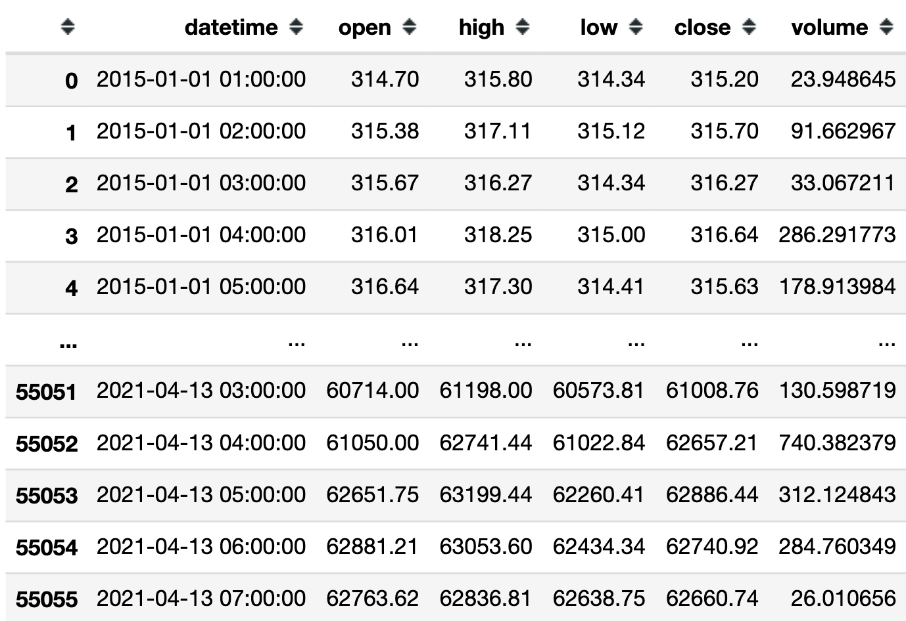
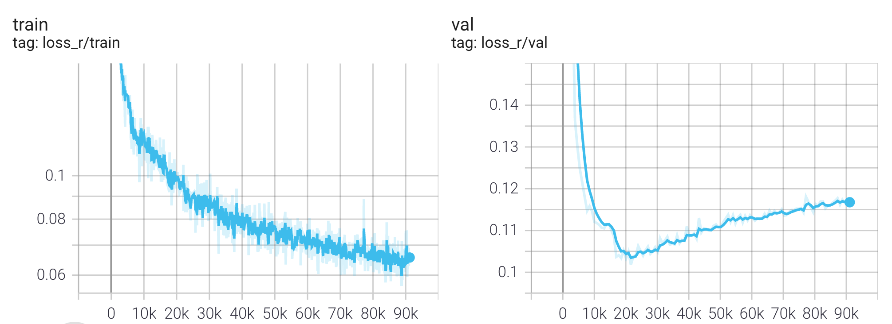
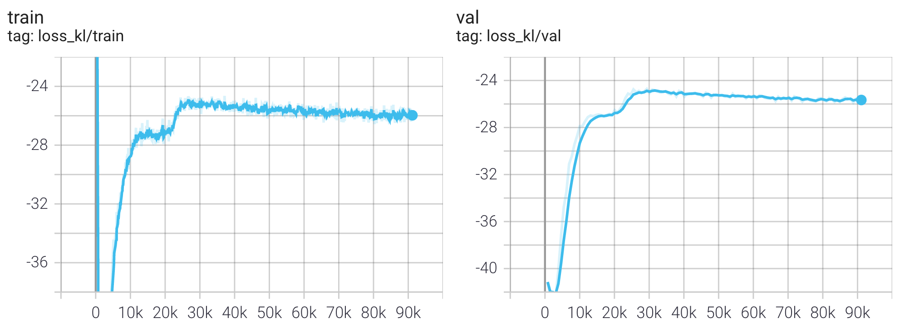
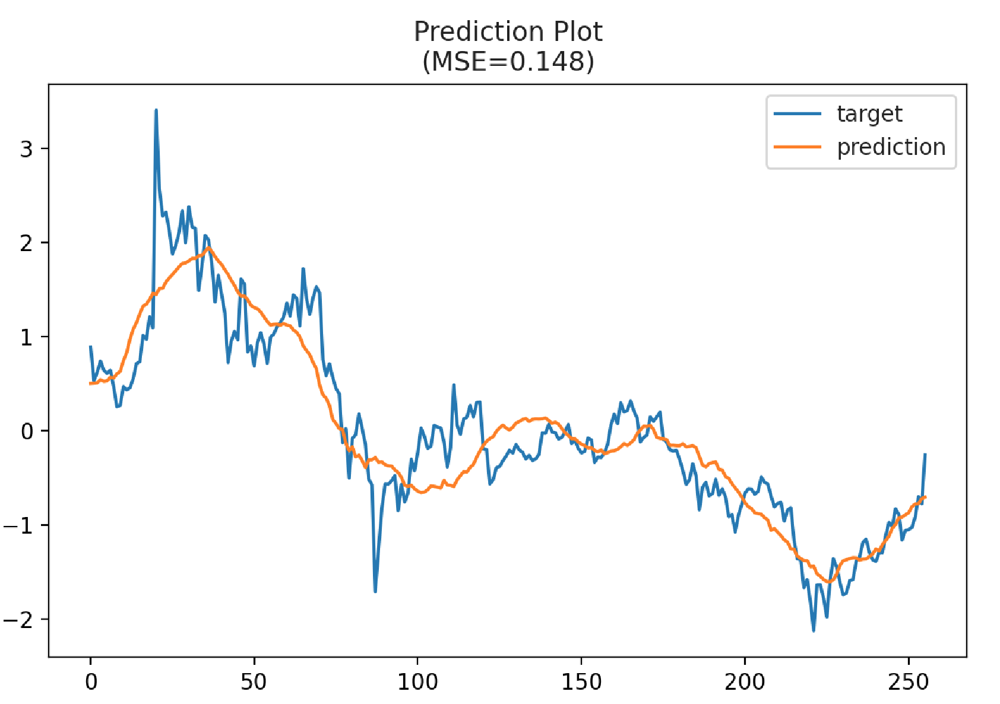
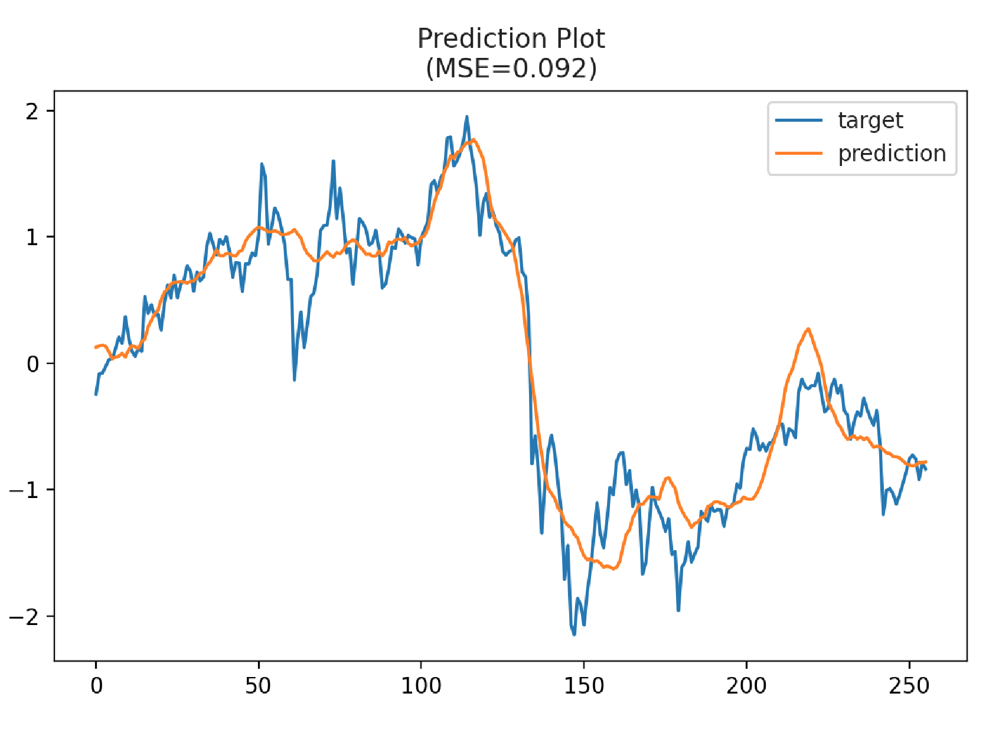
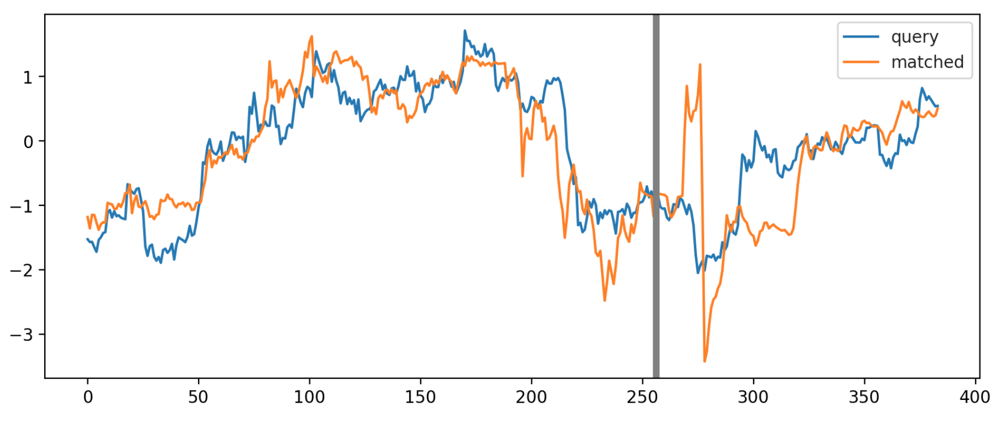
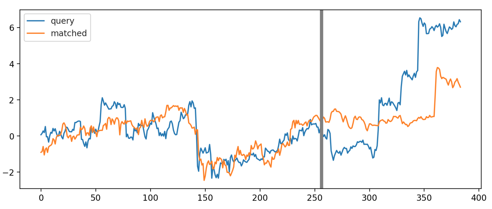
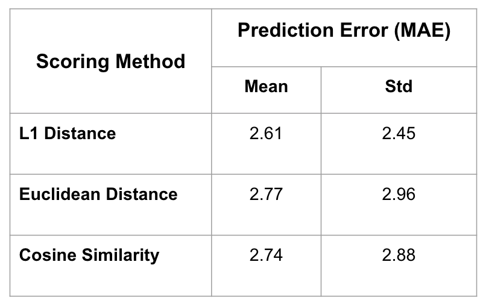

## Table of Contents
* [Abstract](#abstract)
* [Introduction](#introduction)
* [Dataset](#dataset)
* [Method](#method)
* [Results](#results)
* [Report](#report)
* [References](#references)

## Abstract
In this project, I aim to automate the detection of geometric patterns and recurring sequences found in the stock candlestick charts to forecast future prices. Price data of several cryptocurrency ticker symbols were gathered as the dataset. A Variational Autoencoder was trained to transform the data to the latent space and the latent vectors were used to find similar patterns. The results of a naive forecasting approach and different similarity comparators are then presented, and in the discussion part, I will talk about some potentials of the approach and some proposals for future improvements.

## Introduction
Patterns are recurring sequences found in candlestick charts which traders have historically used as buy and sell signals. Those who follow the technical analysis strategy most often use geometric features and patterns the describe a phenomenon. Some of the famous patterns are the Ascending triangle, Double top/bottom, Cup and handle, and Head and shoulders. With the advent of machine learning, there's been work to facilitate and enhance this process [3, 4].
Automation would simplify the process of finding sequences that vary in scale and length. It would also help provide valuable information for stock market price prediction as these signals do offer a small correlation with prices. Alone, the patterns are not enough to predict trends but may yield different results when coupled with other indicators. While I am presenting this project as a price forecasting tool, the output can also be used as a feature for other pipelines and methods.  

In this project, the general approach for forecasting the price is as follow:
1. Given a time-series Q1 of the current price of symbol X, we'd like to look for a similar time-series in our historical price database.
2. Suppose that the time-series M1 matches Q1 perfectly. Since M1 is an historical data, we have access to how M1 continued to change after its own window of time. Let's call the fixed-window time-series that immediately follows M1 as M2.
3. Since Q1 and M1 had similar movements and M1 morphed into M2 after some time, we assume that Q1 will follow the same pattern as well.
4. Using this assumption, we can extrapolate Q1 by using the patterns in M2.

There are a few challenges here:
1. How to find similar time-series in the database?
2. How fast is this approach?
3. How can the outcome be interpreted?

By solving these challenges, we can predict futures prices using historical patterns.
                
            

## 2 Dataset
### 2.1 Summary
The data are the hourly OHLCVs of several cryptocurrency symbols. OHLCV is an aggregated form of market data standing for Open, High, Low, Close, and Volume. the Open and Close represent the first and the last price level during a specified interval. High and Low represent the highest and lowest reached price during that interval. Volume is the total amount traded during that period. This data is most frequently represented in a candlestick chart, which allows traders to perform technical analysis on intraday values [6].
The symbols used for this project are BTC/USD, ETH/USD", "ETH/BTC", "LTC/BTC", "LTC/USD", "XRP/USD", "XRP/BTC". The period of interest for BTC/USD and other symbols was from 2015-01 to 2021-04 and o2017-06 to 2021-04 respectively.

<figure>
  
  <figcaption style="text-align: center; margin: 5px auto; margin-bottom: 50px;"><i>Figure 1: Bitcoin-US Dollar OHLCV sample data</i></figcaption>
</figure>
 

### 2.2 Collection
The [Bitstamp](https://www.bitstamp.net/) cryptocurrency exchange was used as the main data source. While there are other exchanges such as Binance, Coinbase and ByBit that have higher trading volume and liquidity, Bitstamp provides the most access to the historical data. The exchange provides a public REST API for downloading the data, without the need to register an account. For sending the requests, I used the [CCXT](https://github.com/ccxt/ccxt) Python package which provides a unified front for interacting with many cryptocurrency exchanges. 
One of the drawbacks of downloading the data is using paginated requests. Since the data is too large to fit into a single request, many requests needed to be sent for downloading chunks of data. Also, rate limits set by the exchange must be respected otherwise it could result in a ban.

### 2.3 Preprocessing
Generation: In order to use the time-series data for pattern analysis, it must first be split into overlapping windows of fixed size 256. The size of the window is important since it’ll define the shape of the input of the model and also it’s the same size will be used for comparing different patterns. As a result, each data point will represent the price movements of a 256-hour period.
Standardization: When comparing time-series of different periods of time, and possibly of different symbols, it's important that they be at the same scale. Hence, z-score normalization is applied for each data point individually.

## 3 Method
The prediction pipeline consists of 3 main steps:

### 3.1 Encoding
To measure the similarity between a pair of time-series, they must first be encoded to a latent vector. The reasons for encoding are two folds: First, it reduces the dimension of the data which would result in the reduction of computation and storage cost. Secondly, We want to only keep the rich features of the data and remove as much noise as possible. This would be an important step since financial data are known to be noisy.
To encode the data, I’ve used a Variational Autoencoder (VAE) [2], a neural network, implemented in PyTorch. Since it's an autoencoder-class model, its architecture is almost symmetrical. On one side, 1D convolutions with linear layers are used and on the opposite side, linear layers with transposed convolution. LeakyReLU nonlinearity was used as the activation function since we want the activation maps to also have negative signs. That is because the inputs and sampled data from encoding the input are in the [-1, 1] range. For optimizing the network, AdaBelief [4] was used.

After training the VAE model, we can pre-compute the latent vector of every data point in the dataset and use it to find recurring patterns.

### 3.2 Similarity Search
Given a query time-series, we first transform it to the latent space and then compare its latent vector with the other data points by using a distance metric. The choice of the metric is subject to test and evaluation. 

### 3.3 Forecasting
After finding a similar match in the dataset, we will use its original time-series (without normalization) for forecasting. Suppose time-series M1 was found as the best match for query Q1. We'll then look for the time-serise M2 of size N that immediately follows M1 in terms of time. N is the size of the prediction window. Then in order to forecast, M2 needs to be standardized by the mean and variance of M1. After the standardization, M2 needs to be re-scaled back by the mean of variance of Q1. In this way, the difference of magnitude of Q1 and M1 will not cause trouble in the prediction.

## Results
### VAE Model
These are the training results for the VAE model.

<figure>
  
  <figcaption style="text-align: center; margin: 5px auto; margin-bottom: 50px;"><i>Figure : Reconstruction loss. From the validation plot, it can be seen that training the model for 20K iterations would've been enough.</i></figcaption>
</figure>
<figure>
  
  <figcaption style="text-align: center; margin: 5px auto; margin-bottom: 50px;"><i>Figure : Kullback–Leibler divergence loss</i></figcaption>
</figure>
 

<figure>
  
  <figcaption style="text-align: center; margin: 5px auto; margin-bottom: 50px;"><i>Figure : VAE reconstruction plot. It should be noted that reconstructing the input to the fullest is not something desiarble since we want the model to focus on the rich features and patterns. Learning to replicate noises and sharp movements does not enforce that.</i></figcaption>
</figure>
 

<figure>
  
  <figcaption style="text-align: center; margin: 5px auto; margin-bottom: 50px;"><i>Figure : Kullback–Leibler divergence loss</i></figcaption>
</figure>

### Forecasting
The prediction window used here is 256 (as in 256 hours), but in fact, this can an arbitrary number, irrespective of what encoding window was for the training part. The forecasts below are done by calculating the average between the best match and second-best match. The vertical line divides between the query and predicted data.

<figure>
  
  <figcaption style="text-align: center; margin: 5px auto; margin-bottom: 50px;"><i>Figure : Forecast #1</i></figcaption>
</figure>
 

<figure>
  
  <figcaption style="text-align: center; margin: 5px auto; margin-bottom: 50px;"><i>Figure : Forecast #2</i></figcaption>
</figure>

### Search Metric
To compare the latent vector in the search algorithm, three different metrics were used. Cosine similarity, Euclidean distance, and L1 distance. (For the distance functions, the similarity score was calculated as *1 - dist*). The table below shows the prediction error for the selected metrics.

<figure>
  
  <figcaption style="text-align: center; margin: 5px auto; margin-bottom: 50px;"><i>Figure : Prediction error comparison for different similarity scorers</i></figcaption>
</figure>
 

## Discussion

As you can see from the results, VAEs can successfully embed the data while preserving the distances and reducing the noises. It would be a good analysis to explore the latent space learned by VAE in more detail and see if the interpolations between the two data points are meaningful.  

With respect to the forecasting, there seems a correlation between the historical patterns and the current price trends, however, more analysis needs to be done on the way the patterns are extrapolated. Instead of using the best match for the forecast, using an ensemble of top matches to present different scenarios and possibilities might a better idea. It can also open the doors to uncertainty estimation of the prediction and also predicting confidence intervals, something similar to quantile regression. To improve the accuracy further, other features such as open price, volume, etc can be added.

The current pipeline works very fast with few symbols, but if were to add several hundreds of other cryptocurrency symbols, an optimized search method would be warranted. One solution would be to add an optimized K-NN algorithm to find the top matches in O(logn).

## References

[1] Hayes, "Introduction to Technical Analysis Price Patterns," https://www.investopedia.com/articles/technical/112601.asp 

[2] "Stock trading chart patterns guide," https://www.cmcmarkets.com/en/trading-guides/stock-chart-patterns

[3] Velay, Marc, and Fabrice Daniel. "Stock chart pattern recognition with deep learning." arXiv preprint arXiv:1808.00418 (2018).

[4] Dover, Kathryn. “Pattern Recognition in Stock Data.” (2017).

[5] Higgins, Irina, Loic Matthey, Arka Pal, Christopher Burgess, Xavier Glorot, Matthew Botvinick, Shakir Mohamed, and Alexander Lerchner. "beta-vae: Learning basic visual concepts with a constrained variational framework." (2016).

[6] Zhuang, Juntang, et al. "Adabelief optimizer: Adapting stepsizes by the belief in observed gradients." arXiv preprint arXiv:2010.07468 (2020).

[7] [Cryptocurrency OHLCV Data](https://www.kaiko.com/collections/ohlcv)